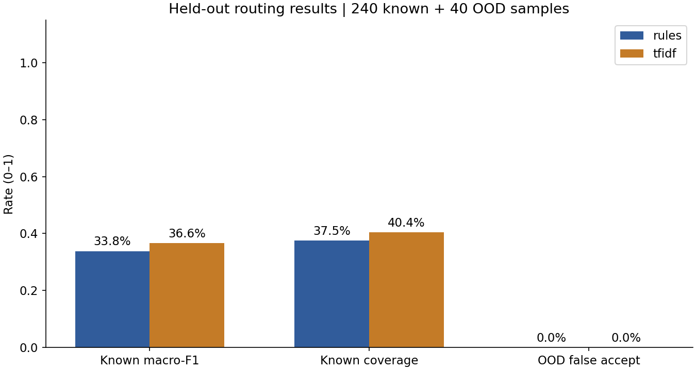
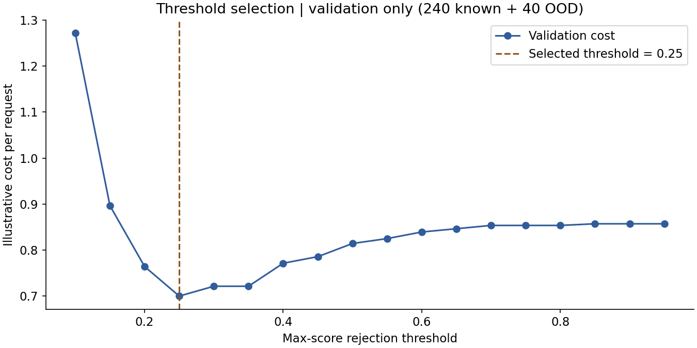
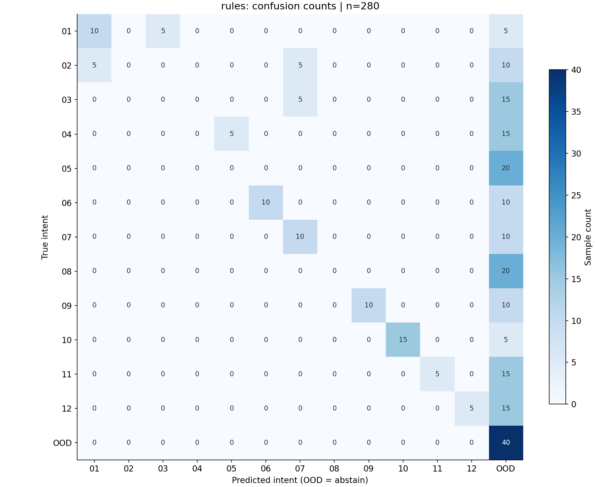
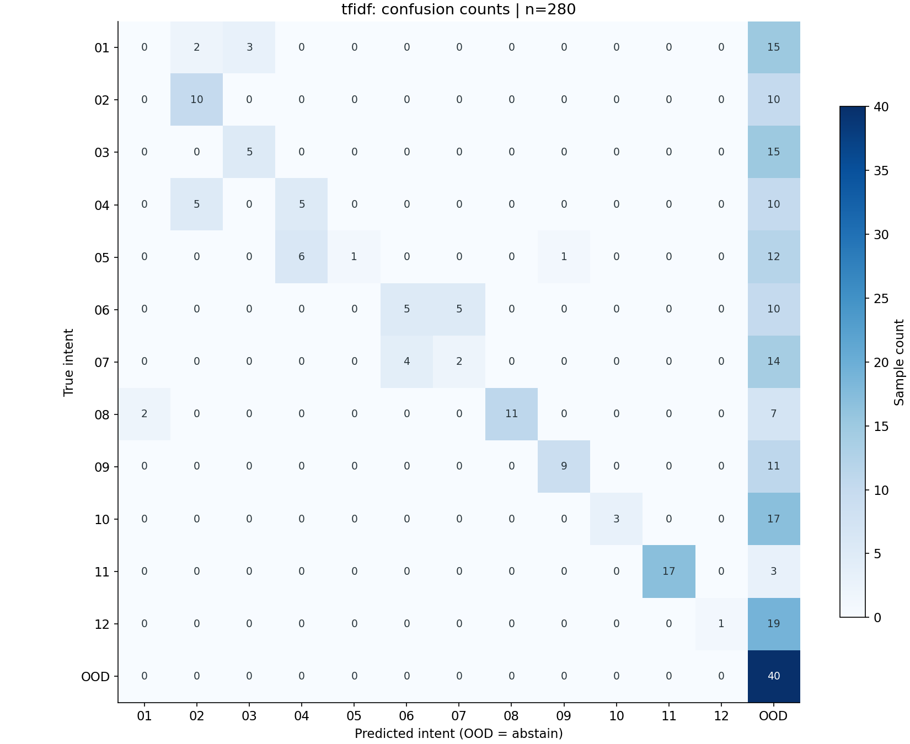

# 第01课基线实测报告

## 数据与方法

数据版本1.0.0；SHA256：`6643d196c8122d9077c7fcf45d1f8ec2c90cd008654eeda0b8f157a1eaaf3bc7`。1200条已知意图来自240个手写核心表达，每个扩写5种礼貌包装；另有80条未知意图。训练720条，验证240已知+40未知，测试240已知+40未知。测试的48个已知表达族是有效分组，240行不是240个独立语言样本。

规则由关键词唯一命中决定；零命中或多意图命中拒识。TF-IDF使用字符2—4 gram，逻辑回归C=4，训练词表只见训练数据。验证集按错路由3、已知拒识1、未知误收5的教学成本选阈值，锁定为 **0.25**；这些成本是教学假设，不是企业核定金额。测试结果未用于修改规则、特征、C或阈值。

## 冻结测试结果

| 方案 | 已知macro-F1 | 已知准确率 | 已知覆盖率 | 未知误收率 | 每请求教学成本 |
|---|---:|---:|---:|---:|---:|
| rules | 0.3385 | 27.1% | 37.5% | 0.0% (0/40) | 0.8036 |
| tfidf | 0.3661 | 28.7% | 40.4% | 0.0% (0/40) | 0.8107 |
| tfidf_forced | 0.6100 | 61.3% | 100.0% | 100.0% (40/40) | 1.7107 |

已知类指标分母240，未知误收分母40。拒识的已知问题按错误计入F1；unknown代表停止自动路由并交人工，不能把拒识说成自动解决。`tfidf_forced`不拒识，只作闭集对照；未知请求被强行分到12类是其固有限制。

## 不确定性与阈值

按意图分层、按表达族配对bootstrap 1000次，95%百分位区间：规则F1 [0.21425595238095238, 0.4146164021164021]；带拒识TF-IDF F1 [0.25526108889676696, 0.44905849161806277]；两者差值 [-0.11411614516136113, 0.17748779500710318]。区间只描述该合成表达池的抽样变化，不包含真实业务分布偏移或多次重新训练的不确定性。

## 数据隔离与剩余相似性

客户跨集合数0，表达族跨集合数0，去标点/空白归一后完全重复数0。训练拟合的TF-IDF近重复诊断：相似度≥0.85有0/240条，最高0.689；见[最近训练样本](nearest-train.csv)。客户ID与表达族在本合成数据中一一对应，真实业务需独立核查两种分组。通用包装、关键词、语义仍可能相似，分组无交叉不等于没有分布偏差。

## 运行环境与耗时

Python 3.12.13，macOS-26.6.2-arm64-arm-64bit；arm64，逻辑CPU 10，数值计算线程限制1。版本见[原始结果](results.json)。训练耗时0.0527秒，词表4133项。

串行单条请求，预热10条后测280条：规则P50/P95=0.0064/0.0079ms；TF-IDF=0.1686/0.1938ms。这是本地分类调用时间，包含文本处理、预测及拒识，不含网络、排队、业务执行或人工时间；不是服务SLA。无模型API调用费，不等于总业务成本为零。

## 混淆矩阵与错误样本

数字图例：01=物流查询；02=取消订单；03=退款进度；04=退货申请；05=换货申请；06=发票问题；07=支付问题；08=修改收件信息；09=保修维修；10=安装使用；11=服务投诉；12=售前咨询；OOD=unknown。行是真实标签，列是预测标签，矩阵包含全部280条。

下面按文件顺序列出最多20个不同表达族的失败（任一方案失败即入选），完整结果见[predictions.csv](predictions.csv)。它们是诊断样例，不是额外调参集。

| ID | 输入 | 真实 | 规则 | TF-IDF |
|---|---|---|---|---|
| S0003 | 想请你帮忙：不是换货，我要退回商品。 | return_request | exchange_request | unknown |
| S0006 | 想请你帮忙：发票以后再说，现在支付失败。 | payment | unknown | invoice |
| S0007 | 不要求换货，只想送去维修。 | warranty | unknown | warranty |
| S0010 | 我这边的情况是：收件地点写成旧办公室了，谢谢。 | change_address | unknown | unknown |
| S0013 | 想请你帮忙：没发货的这单请停止履约。 | cancel_order | shipping_status | unknown |
| S0022 | 麻烦确认一下，未支付的购买记录能撤掉吗。 | cancel_order | payment | unknown |
| S0047 | 想请你帮忙：不是要重新退货，只查之前退的钱。 | refund_status | unknown | unknown |
| S0055 | 我这边的情况是：支付账户没有收到返还的金额，谢谢。 | refund_status | payment | unknown |
| S0061 | 想请你帮忙：已经拆封但不需要了能寄回吗。 | return_request | unknown | unknown |
| S0076 | 麻烦确认一下，付款没问题，只是开票失败。 | invoice | unknown | payment |
| S0077 | 想请你帮忙：不是咨询购买参数，我已经买了想安装。 | technical_help | technical_help | unknown |
| S0080 | 你好，包裹上的联系人名字要纠正？ | change_address | unknown | shipping_status |
| S0083 | 想请你帮忙：报销需要税务票据，如何申请。 | invoice | invoice | unknown |
| S0087 | 想请你帮忙：不是问退款，我遇到重复扣款。 | payment | unknown | unknown |
| S0089 | 想请你帮忙：给门店选设备，哪款支持有线接口。 | product_info | unknown | unknown |
| S0092 | 想请你帮忙：已经扣费却说我还没有完成支付。 | payment | payment | unknown |
| S0094 | 你好，签收的货想退掉，不是取消未发货订单？ | return_request | unknown | cancel_order |
| S0121 | 我这边的情况是：退货物流已结束，为什么款没到，谢谢。 | refund_status | unknown | unknown |
| S0123 | 你好，不查订单物流，想知道商品是否有现货？ | product_info | unknown | unknown |
| S0125 | 我这边的情况是：按照手册操作仍无法配对，请给排查步骤，谢谢。 | technical_help | technical_help | unknown |

## 24条人工设计困难案例

独立教学挑战集，不参与训练、阈值选择或上述280条主指标。expected_intent为本课程标注规范下的目标：多诉求/无上下文指代设为unknown，表示先澄清。每条的成因说明在运行前编写，预测列为实际运行所得。

| ID | 输入 | 预期 | 规则 | TF-IDF | 边界及改进方向 |
|---|---|---|---|---|---|
| H01 | 不用退货，只要告诉我退款到了没有 | refund_status | unknown | refund_status | 否定退货，主诉求是查款；关键词同时命中需理解否定范围。 |
| H02 | 不要取消订单，只是改收货地址 | change_address | unknown | change_address | 取消被否定，地址才是动作；应识别目标动作后校验订单。 |
| H03 | 不想维修，我要求换货 | exchange_request | unknown | warranty | 维修被否定，换货有效；不能把所有出现的名词等权。 |
| H04 | 不是支付失败，是发票开错了 | invoice | unknown | invoice | 支付作为排除背景，真正问题为发票。 |
| H05 | 物流到货了，我要投诉客服辱骂 | complaint | unknown | complaint | 物流是已完成背景，投诉是当前目的。 |
| H06 | 电子票的抬头要改成单位 | invoice | invoice | invoice | 电子票有歧义，抬头和单位提供开票证据；缺这些词应澄清。 |
| H07 | APP里付过钱还是待付 | payment | unknown | unknown | 口语省略支付术语，需同义表达覆盖。 |
| H08 | 货别寄了，订单给我作废 | cancel_order | unknown | cancel_order | 没有取消关键词，作废和未寄暗示撤单。 |
| H09 | 之前返还的款项现在走哪一步 | refund_status | unknown | unknown | 返还款项是退款状态，不能被进度词直接归为物流。 |
| H10 | 签收后不合心意，想寄还商家 | return_request | unknown | unknown | 签收后寄还是退货，不是取消。 |
| H11 | 它为什么又这样了 | unknown | unknown | unknown | 无指代上下文，必须询问设备和现象，不能硬分。 |
| H12 | 帮我改地址，再补一张发票 | unknown | unknown | unknown | 两个独立动作，单标签协议先澄清或拆任务。 |
| H13 | 我要查物流，同时申请另一单退货 | unknown | unknown | unknown | 涉及两个订单与两个目的，不能单标签自动办理。 |
| H14 | 这笔钱不对 | unknown | unknown | unknown | 可能是扣款、退款或开票金额，需补充上下文。 |
| H15 | 写一首包含退款和发票的诗 | unknown | unknown | invoice | 有业务关键词但请求是创作，属于支持范围外。 |
| H16 | 帮我翻译这句话：我要取消订单 | unknown | cancel_order | cancel_order | 被引用句子不是当前业务动作，应识别元请求。 |
| H17 | 预测明年物流公司的股票价格 | unknown | shipping_status | unknown | 物流词不意味着物流查询，实际是金融预测。 |
| H18 | 讲一个客服投诉的笑话 | unknown | complaint | complaint | 客服词汇嵌入娱乐请求，不属于正式投诉。 |
| H19 | 刚付款还没寄出，这一单不要了 | cancel_order | payment | cancel_order | 付款是背景，未寄出且不要了对应取消。 |
| H20 | 已经收到了，这一单不要了 | return_request | unknown | return_request | 签收状态决定退货路径，词袋难建模状态条件。 |
| H21 | 还没买，想知道能连接哪些电脑 | product_info | unknown | unknown | 未购买，兼容性问题属于售前咨询。 |
| H22 | 已经买了，教我怎样连接电脑 | technical_help | unknown | unknown | 已购买，当前目的为操作指导。 |
| H23 | 用了几个月坏了，能不能免费修 | warranty | unknown | unknown | 时间、损坏、免费修共同指向保修。 |
| H24 | 尺寸不合适，我想换大号，不要退款 | exchange_request | unknown | exchange_request | 换大号有效、退款否定，不能被两个关键词强行归类。 |

## 结论与边界

应根据质量、覆盖率与误收共同选择方案，而非仅比较F1。规则对冲突采取保守拒识，TF-IDF可能吸收更多表达但仍无法可靠理解否定、多个诉求和上下文。该数据中的未知意图主要是明显域外问题，低误收不代表能识别贴近业务边界的所有未知请求；挑战集用于暴露这一限制。

本实验测量的是意图路由，不能据此宣称客服自动解决率、满意度或处理时长已经改善。下一步可在新开发集研究否定、槽位与小模型，对原冻结测试集仅做回归，不以反复调试后的成绩冒充首次泛化。实测数值和时延可由CLI复跑；浮点尾数和时延允许受硬件影响。
