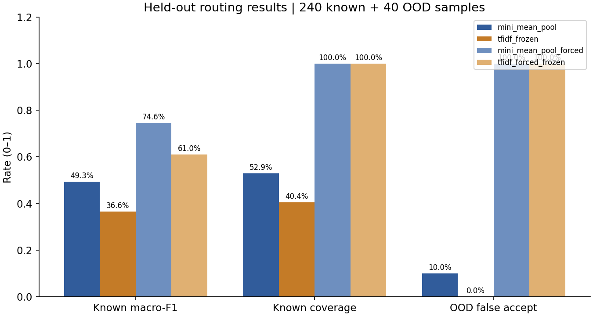
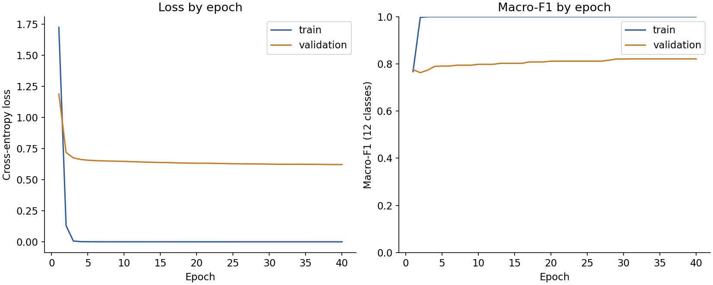
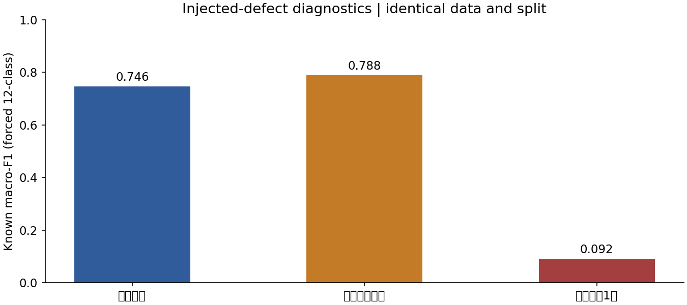
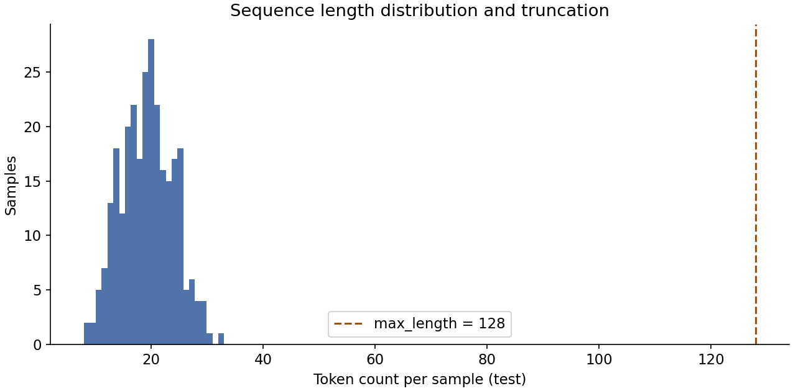
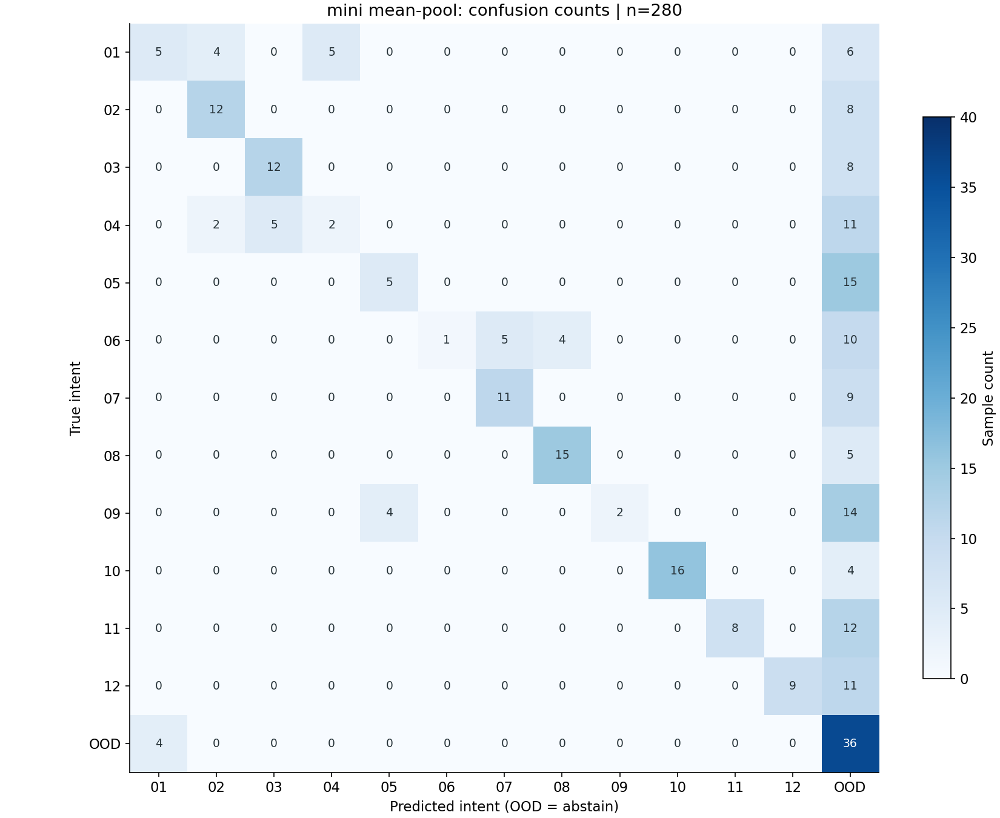

# 第02课张量与文本表示实测报告

## 数据与方法

沿用第01课冻结数据版本 1.0.0，SHA256：`6643d196c8122d9077c7fcf45d1f8ec2c90cd008654eeda0b8f157a1eaaf3bc7`；本课不重新生成数据。
训练720、验证240已知+40未知、测试240已知+40未知；客户与表达族隔离，测试每已知类20条。

编码为字符级词表：`<pad>`固定索引0、`<unk>`固定索引1，其余token按训练集频次与字典序排序。
词表只从训练集构建（词表345项，最长序列128），
验证与测试的未见token计为UNK；截断发生在编码阶段，不由模型处理。
训练后统计的OOV发生率为4.9785%（1065/21392个token）。

模型是最小的embedding均值池化分类器：IDs→查表→按mask求均值→线性层→softmax交叉熵，
参数量22860（embedding 22080＋分类头
780）。填padding参与均值或标签错位属于注入缺陷，见下文。

## 手写反向的数值校验

在训练前对一个小batch做中心差分数值梯度校验（epsilon=1e-06），
比较手写反向与数值梯度：

| 参数 | 最大相对误差 | 元素数 |
|---|---:|---:|
| embedding_table | 5.149e-05 | 22080 |
| classifier_weight | 5.259e-05 | 768 |
| classifier_bias | 1.259e-09 | 12 |

相对误差在 1.3e-09 到
5.3e-05 之间。
中心差分在epsilon=1e-06、float64下本身的截断与舍入误差约为1e-5量级，
因此该结果说明embedding查表的scatter-add、masked mean的按长度缩放和线性层梯度方向正确；
偏置的误差最小（1e-9量级），因为它不经过embedding求和。校验只覆盖这些小规模算子，
不代表大模型训练栈已被验证。

## 冻结测试结果

| 方案 | 已知macro-F1 | 已知准确率 | 已知覆盖率 | 未知误收率 | 每请求教学成本 |
|---|---:|---:|---:|---:|---:|
| mini_mean_pool | 0.4926 | 40.8% | 52.9% | 10.0% (4/40) | 0.7857 |
| mini_mean_pool_forced | 0.7456 | 75.4% | 100.0% | 100.0% (40/40) | 1.3464 |
| tfidf_frozen | 0.3661 | 28.7% | 40.4% | 0.0% (0/40) | 0.8107 |
| tfidf_forced_frozen | 0.6100 | 61.3% | 100.0% | 100.0% (40/40) | 1.7107 |

已知类指标分母240条；未知误收分母40条。`mini_mean_pool`为带拒识的均值池化模型，
`tfidf_frozen`为第01课已保存的TF-IDF＋拒识结果（本课不重新训练该模型）；
`*_forced`是不拒识的闭集对照，未知请求被强行分到12类是其固有限制，
与第01课的`tfidf_forced`口径一致。

## 训练过程

40个epoch，Adam，学习率0.05，batch 64，梯度裁剪5.0，随机种子20260915。
训练集loss从1.7221降至0.0001；
验证集loss从1.1882变为0.6204，
验证macro-F1从0.7756变为0.8212。

若训练loss持续下降而验证指标不升，说明模型在记忆训练表达；本数据中训练与测试的表达族完全不重叠，
这类差距属于预期，不应通过继续训练来消除。

## 缺陷复现：补齐与标签

| 配置 | 已知macro-F1（强制分类） | 已知准确率 | 末轮训练loss | 说明 |
|---|---:|---:|---:|---|
| 正确实现 | 0.7456 | 75.4% | 0.0001 | 补齐位置权重为0，标签与输入对应 |
| 补齐参与均值 | 0.7879 | 79.2% | 0.0001 | 池化被补齐位置的初始embedding拉偏 |
| 标签错位1位 | 0.0915 | 10.4% | 1.6388 | 输入与标签不再对应，退化为随机 |

第一行是正确实现（补齐位置权重为0）。第二行让补齐位置进入均值池化：同一个训练好的模型、
同一批测试样本下，池化向量的最大差异为 0.5243，
30/280条预测发生改变。
把样本补到不同宽度时，正确实现的池化漂移为
0.00e+00，
而缺陷实现为
0.3401，
即同一句话的表示随batch内最长样本变化，训练与推理的batch组成不同就会得到不同结果。

**注意**：该缺陷在本测试集上的已知macro-F1反而更高，说明"指标变好"不能证明实现正确；
它的真实代价是表示不稳定，在长度分布变化或单条推理时才会暴露。这是本课要建立的判断习惯。
第三行把标签整体错位，输入与标签不再对应，末轮训练loss仍为
1.6388、macro-F1降至
0.0915（接近随机）；
真实项目里这类错误常表现为"训练正常但预测几乎全是同一类"。

## 补齐不变性与长度

正确的masked mean在同一句话被补到不同长度时给出相同池化向量：本实现按有效长度归一、
补齐位置权重为0，因此表示与batch内最长样本无关。代价是序列越长、batch内最长样本越长，
算力与内存占用越高。本批次序列很短（训练集最长
27token、测试集最长
33token），128的截断上限没有截掉任何样本；
真实业务的长文档必须逐个统计截断比例并在报告中声明。

## 不确定性与混淆矩阵

按意图分层、按表达族配对bootstrap 1000次，95%百分位区间：
均值池化F1 [0.3649, 0.5748]；
第01课TF-IDF F1 [0.2531, 0.4531]；
两者差值 [-0.0140, 0.2546]。
差值区间跨0，说明在这份合成困难测试上不能断言均值池化稳定优于第01课TF-IDF，
只能说它把强制分类的F1从0.6100提升到0.7456，代价是拒识阈值附近的误收风险更高。
区间只描述该合成表达池的抽样变化，不包含重新训练或真实业务分布带来的不确定性。

图例：01=物流查询；02=取消订单；03=退款进度；04=退货申请；05=换货申请；06=发票问题；07=支付问题；08=修改收件信息；09=保修维修；10=安装使用；11=服务投诉；12=售前咨询；OOD=unknown（拒识）。

## 失败样本

下面是前20条失败样本（按文件顺序），`length`为编码后的token数：
长度差异越大、表达越依赖词序或否定，均值池化越难区分。

| ID | 输入 | 真实 | 均值池化 | 第01课TF-IDF | 长度 |
|---|---|---|---|---|---|
| S0003 | 想请你帮忙：不是换货，我要退回商品。 | return_request | unknown | unknown | 18 |
| S0006 | 想请你帮忙：发票以后再说，现在支付失败。 | payment | unknown | invoice | 20 |
| S0007 | 不要求换货，只想送去维修。 | warranty | exchange_request | warranty | 13 |
| S0013 | 想请你帮忙：没发货的这单请停止履约。 | cancel_order | unknown | unknown | 18 |
| S0039 | 你好，不是换货，我要退回商品？ | return_request | unknown | unknown | 15 |
| S0047 | 想请你帮忙：不是要重新退货，只查之前退的钱。 | refund_status | unknown | unknown | 22 |
| S0061 | 想请你帮忙：已经拆封但不需要了能寄回吗。 | return_request | unknown | unknown | 20 |
| S0062 | 我这边的情况是：不是换货，我要退回商品，谢谢。 | return_request | unknown | unknown | 23 |
| S0076 | 麻烦确认一下，付款没问题，只是开票失败。 | invoice | payment | payment | 20 |
| S0077 | 想请你帮忙：不是咨询购买参数，我已经买了想安装。 | technical_help | unknown | unknown | 24 |
| S0083 | 想请你帮忙：报销需要税务票据，如何申请。 | invoice | unknown | unknown | 20 |
| S0087 | 想请你帮忙：不是问退款，我遇到重复扣款。 | payment | unknown | unknown | 20 |
| S0094 | 你好，签收的货想退掉，不是取消未发货订单？ | return_request | cancel_order | cancel_order | 21 |
| S0108 | 我这边的情况是：签收的货想退掉，不是取消未发货订单，谢谢。 | return_request | unknown | cancel_order | 29 |
| S0121 | 我这边的情况是：退货物流已结束，为什么款没到，谢谢。 | refund_status | unknown | unknown | 26 |
| S0123 | 你好，不查订单物流，想知道商品是否有现货？ | product_info | unknown | unknown | 21 |
| S0128 | 麻烦确认一下，请对工作人员的敷衍做出处理。 | complaint | unknown | complaint | 21 |
| S0132 | 你好，没打算取消，想催一下发货？ | shipping_status | cancel_order | cancel_order | 16 |
| S0144 | 我这边的情况是：别查退款进度，我还没申请退货，谢谢。 | return_request | refund_status | return_request | 26 |
| S0152 | 你好，签收后才发现买小了，想换大一号？ | exchange_request | unknown | unknown | 19 |

## 24条人工困难案例

同一挑战集，说明手写模型的边界；预期标签沿用第01课标注规范（多诉求或指代不明记unknown）。

| ID | 输入 | 预期 | 均值池化 | 边界及改进方向 |
|---|---|---|---|---|
| H01 | 不用退货，只要告诉我退款到了没有 | refund_status | refund_status | 否定退货，主诉求是查款；关键词同时命中需理解否定范围。 |
| H02 | 不要取消订单，只是改收货地址 | change_address | change_address | 取消被否定，地址才是动作；应识别目标动作后校验订单。 |
| H03 | 不想维修，我要求换货 | exchange_request | exchange_request | 维修被否定，换货有效；不能把所有出现的名词等权。 |
| H04 | 不是支付失败，是发票开错了 | invoice | payment | 支付作为排除背景，真正问题为发票。 |
| H05 | 物流到货了，我要投诉客服辱骂 | complaint | complaint | 物流是已完成背景，投诉是当前目的。 |
| H06 | 电子票的抬头要改成单位 | invoice | invoice | 电子票有歧义，抬头和单位提供开票证据；缺这些词应澄清。 |
| H07 | APP里付过钱还是待付 | payment | refund_status | 口语省略支付术语，需同义表达覆盖。 |
| H08 | 货别寄了，订单给我作废 | cancel_order | cancel_order | 没有取消关键词，作废和未寄暗示撤单。 |
| H09 | 之前返还的款项现在走哪一步 | refund_status | refund_status | 返还款项是退款状态，不能被进度词直接归为物流。 |
| H10 | 签收后不合心意，想寄还商家 | return_request | return_request | 签收后寄还是退货，不是取消。 |
| H11 | 它为什么又这样了 | unknown | product_info | 无指代上下文，必须询问设备和现象，不能硬分。 |
| H12 | 帮我改地址，再补一张发票 | unknown | change_address | 两个独立动作，单标签协议先澄清或拆任务。 |
| H13 | 我要查物流，同时申请另一单退货 | unknown | shipping_status | 涉及两个订单与两个目的，不能单标签自动办理。 |
| H14 | 这笔钱不对 | unknown | refund_status | 可能是扣款、退款或开票金额，需补充上下文。 |
| H15 | 写一首包含退款和发票的诗 | unknown | invoice | 有业务关键词但请求是创作，属于支持范围外。 |
| H16 | 帮我翻译这句话：我要取消订单 | unknown | cancel_order | 被引用句子不是当前业务动作，应识别元请求。 |
| H17 | 预测明年物流公司的股票价格 | unknown | invoice | 物流词不意味着物流查询，实际是金融预测。 |
| H18 | 讲一个客服投诉的笑话 | unknown | complaint | 客服词汇嵌入娱乐请求，不属于正式投诉。 |
| H19 | 刚付款还没寄出，这一单不要了 | cancel_order | cancel_order | 付款是背景，未寄出且不要了对应取消。 |
| H20 | 已经收到了，这一单不要了 | return_request | shipping_status | 签收状态决定退货路径，词袋难建模状态条件。 |
| H21 | 还没买，想知道能连接哪些电脑 | product_info | product_info | 未购买，兼容性问题属于售前咨询。 |
| H22 | 已经买了，教我怎样连接电脑 | technical_help | technical_help | 已购买，当前目的为操作指导。 |
| H23 | 用了几个月坏了，能不能免费修 | warranty | warranty | 时间、损坏、免费修共同指向保修。 |
| H24 | 尺寸不合适，我想换大号，不要退款 | exchange_request | exchange_request | 换大号有效、退款否定，不能被两个关键词强行归类。 |

## 逐类表现

`recall`为强制分类下该类别的召回；域外行（unknown）无闭集召回，只看是否被误收。

| 类别 | 中文 | 测试n | 强制分类召回 |
|---|---|---:|---:|
| shipping_status | 物流查询 | 20 | 45.0% |
| cancel_order | 取消订单 | 20 | 100.0% |
| refund_status | 退款进度 | 20 | 100.0% |
| return_request | 退货申请 | 20 | 50.0% |
| exchange_request | 换货申请 | 20 | 75.0% |
| invoice | 发票问题 | 20 | 50.0% |
| payment | 支付问题 | 20 | 100.0% |
| change_address | 修改收件信息 | 20 | 100.0% |
| warranty | 保修维修 | 20 | 60.0% |
| technical_help | 安装使用 | 20 | 100.0% |
| complaint | 服务投诉 | 20 | 65.0% |
| product_info | 售前咨询 | 20 | 60.0% |
| unknown | 拒识/未知 | 40 | — |

## 环境与边界

Python 3.12.13，macOS-27.0-arm64-arm-64bit；
训练耗时3.27秒（单线程），推理在CPU完成，无API调用、无GPU。

本实验只测意图路由，不能据此宣称客服自动解决率或处理时长改善。
字符级编码、均值池化与这个规模的训练结果不能外推到子词分词、上下文模型或生产数据。
